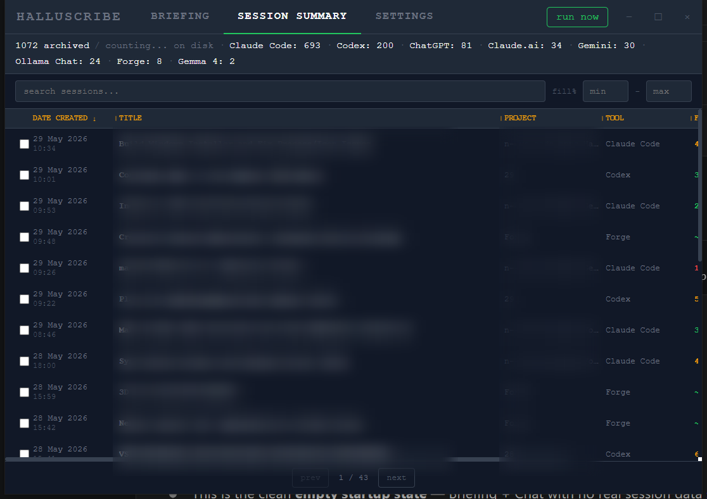
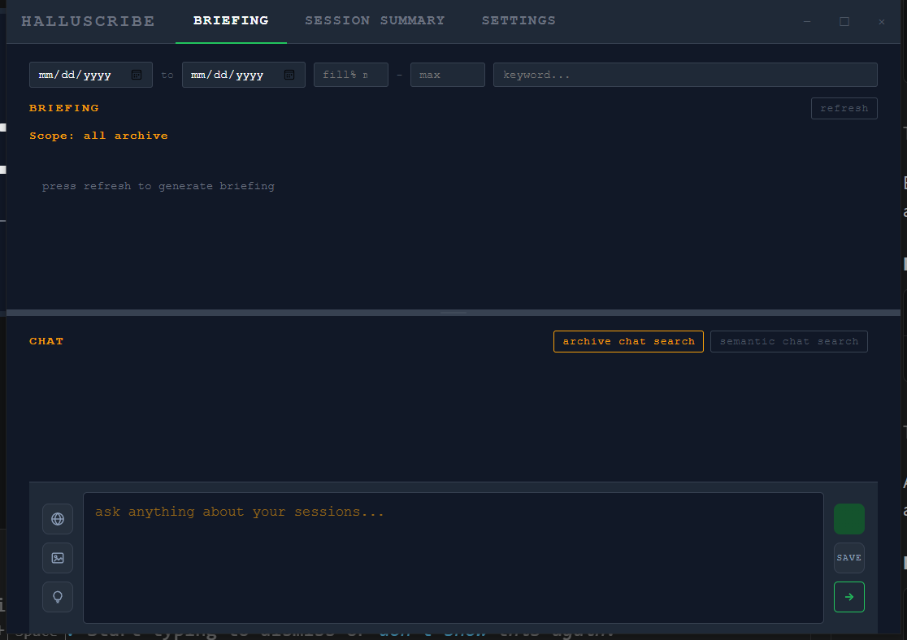
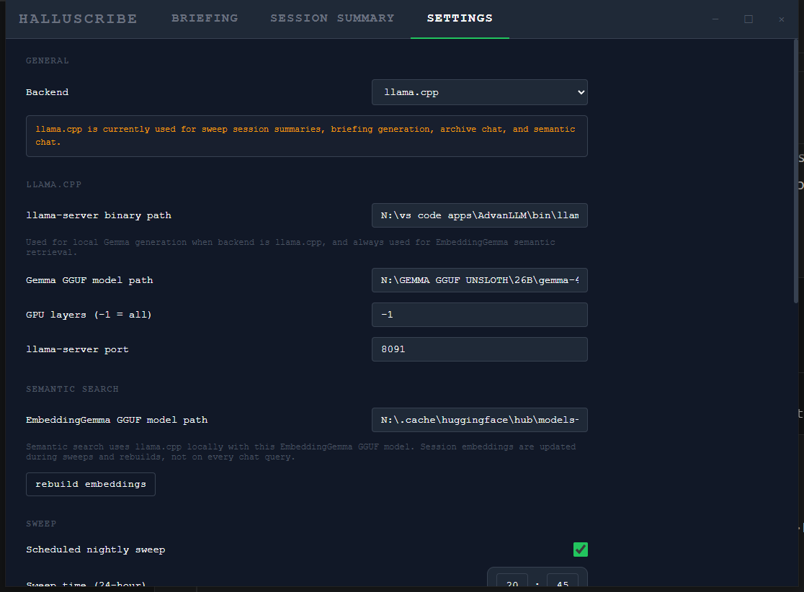

<p align="center">
  
</p>

<h1 align="center">HalluScribe</h1>

> Turn every AI coding session into a searchable, human-readable log — fully local, zero API cost.

HalluScribe reads coding-session files from Claude Code, Codex, and Forge, plus exported chats from ChatGPT, Claude.ai, Gemini, and Grok. It summarises them with a **local model** (Gemma 4 by default) and saves structured Markdown archives to disk. A configurable nightly sweep runs automatically — no real-time hooks, no cloud calls, and no data leaves the machine unless you explicitly enable an optional web-search provider or export data.

Pair it with **[HalluMeter](https://github.com/Efs-O/hallumeter)** for real-time context-window risk monitoring during active sessions.

---

## Screenshots

<p align="center">
  
</p>

| Briefing &amp; chat | Settings |
|---|---|
|  |  |

---

## How it works

1. The nightly sweep scans session files from every configured tool.
2. Each session is preprocessed (tool calls collapsed, metadata stripped) — raw 200K-token JSONL files reduce to ~10–20K tokens.
3. The local model runs to produce a structured summary: title, narrative, session type, error tags, topic tags.
4. The archive writer saves a Markdown file and updates the searchable index.
5. The Briefing and Chat features let you query your entire session history using the same local model.

---

## Supported input sources

| Source | File location |
|---|---|
| Claude Code | `~/.claude/projects/**/*.jsonl` |
| OpenAI Codex | `~/.codex/sessions/**/*.jsonl` |
| Forge | `~/.cursor/projects/*/agent-transcripts/*/*.jsonl` |
| ChatGPT | Exported `conversations.json` (configurable path) |
| Claude.ai | Exported `conversations.json` (configurable path) |
| Gemini | Exported `My Activity.json` / Takeout archive (configurable path) |
| Grok | Exported `prod-grok-backend.json` (configurable path) |
| HalluScribe Chat | Recorded Gemma chat sessions saved within the app |

---

## Features

### Nightly sweep
Runs automatically at a configurable time (default 02:00). Skips sessions already archived, sessions below the minimum fill-% threshold, and short sessions not worth summarising. The **Run Now** button bypasses the time window for an immediate sweep. First launch scans your full history — no cutoff.

### Session archive
Each summarised session is saved as a Markdown file under `~/.halluscribe/archive/`. Every entry includes:
- Gemma-generated title and narrative summary
- Session type: Debugging · Building · Refactoring · Exploration
- Error tags and topic tags (grounded — only terms present in the transcript)
- Source tool, fill %, duration, model used

### Briefing
Opens automatically when the app starts. The model reads your recent archived sessions and produces a concise briefing of what you worked on. Scope is configurable — last N days, a date range, a keyword filter, or a manual selection of sessions. Streams token-by-token with a collapsible reasoning bubble.

### Chat
Ask questions about your archive in natural language. The model uses tool calls to search and read sessions, then answers with specific references. Supports:
- **Archive search** — full-text and parameterised (date, tags, project, tool, fill %)
- **Semantic search** — embedding-based retrieval using a local EmbeddingGemma model
- **Web search** — Tavily or Ollama-backed, optional and user-controlled
- **Image attachments** — paste screenshots directly into the chat input
- Streaming responses with thinking-bubble display
- Recorded chat sessions saved and re-ingested by the nightly sweep

### Session browser
Browse, filter, and sort all archived sessions in a paginated table. Full-text search across titles, projects, and tags. Select sessions individually and send them to the Briefing scope. Delete sessions from the index.

### Semantic search
Embeddings are computed locally using a second GGUF model and stored in `embeddings.json`. Cosine similarity retrieval returns the most contextually relevant sessions for any query — no keyword match required.

### Profiles
The model distills your archived sessions into a living **profile** — identity, projects, conventions, recurring problems, working style, and a timeline — regenerated as new sessions land. Two scopes:
- **Work** — derived from your coding sessions only.
- **Personal** — a superset that also folds in private-chat exports (ChatGPT, Claude.ai, Gemini) for life context, organised into life sections.

The Profile panel shows each scope in its own tab and lets you rebuild on demand. The same profiles back the `get_profile` MCP tool, so external agents can read them too.

Every fact carries session-id citations that are validated against the archive index at write time — a claim you can't trace to a real session is dropped, never invented. Each profile also ends with a deterministic **Project Activity** table (per-project session counts, first/last seen, active/quiet/dormant status) computed straight from the index, untouched by the model.

### Persona Pack export
Export a portable **persona pack** (`~/.halluscribe/exports/<user>-<scope>-persona-<date>.zip`) — the distilled profile, weekly digests, redacted session Markdown, a filtered index, and a manifest. A consent filter governs what leaves the machine; raw transcripts are excluded unless you explicitly opt in, and embeddings are never included.

### Workspaces
Hold more than one person's archive on a single machine. Each **workspace** is an isolated root with its own index, profiles, raw copies, and settings. Switch the active workspace from Settings; guest workspaces can be set **import-only** so a sweep ingests only that person's chat exports, never the host machine's coding sessions. Workspace entries collapse to a compact header row (name, active marker, Switch) so a long list stays manageable; expand a row to rename, toggle import-only, or delete.

Every path field in Settings — model files, binaries, chat-import folders, workspace roots — pairs its text input with a native **Browse…** dialog, so paths can be picked from the OS file/folder picker or typed as before.

### Privacy &amp; redaction
A secret scanner flags likely credentials (API keys, tokens) in each session, and a per-session redaction panel lets you review and strip sensitive spans before anything is exported or exposed over MCP. Redaction is applied to archive Markdown and MCP reads; raw copies are never redacted and never leave unless you opt in.

### Raw transcript preservation
With `preserve_raw_transcripts` enabled, the sweep keeps a compressed verbatim copy of each new transcript (`raw/<id>.jsonl.zst`) alongside the summary. In addition, a **startup capture pass** preserves raws of new coding sessions as soon as the app launches — so transcripts pruned by their source tool before the nightly sweep are no longer lost; captured-but-not-yet-summarised sessions show up in raw search flagged accordingly. Raw copies are never redacted and are excluded from exports by default. A backfill action can capture raw for already-archived sessions.

Raw transcripts are searchable (literal substring, in-app and over MCP) and readable in full (paged) by any agent with archive access — including credentials or secrets that appeared in terminal output during a session. Review what your transcripts contain before pointing external agents at the archive.

### Voice (text-to-speech)
Finished assistant replies in every chat scope get a **Speak** button, backed by a local [piper](https://github.com/rhasspy/piper) voice — no cloud TTS. Configure the voice and piper path in Settings; playback runs off the UI thread.

---

## MCP server

`halluscribe-mcp` is a second, standalone binary (no Tauri runtime) that exposes your archive over the [Model Context Protocol](https://modelcontextprotocol.io/) via stdio JSON-RPC — so any MCP client (Claude Code, Codex, etc.) can query it directly. The point: give every future agent session memory of all previous ones, without re-explaining context that's already sitting in your archive.

It is **strictly read-only** — six tools, no write/redact/delete surface:

| Tool | What it returns |
|---|---|
| `search_sessions` | A paginated page of matching session index entries (title, tags, tool, date). Unquoted multi-word queries are AND-of-keywords; quote the query for exact-phrase matching |
| `read_session` | The full redaction-applied Markdown body of one session, by id |
| `search_raw_transcripts` | Literal case-insensitive substring search over the preserved raw transcripts, grouped per session with excerpts (newest first, default 40 session groups, capped at 120) — for exact strings that never survive into the summaries |
| `read_raw_session` | One session's preserved raw transcript verbatim, paged (default 20 000 bytes per page, capped at 50 000) |
| `get_profile` | The distilled profile for the requested `scope` (`work` default, or `personal`) — identity, projects, conventions, recurring problems, style, timeline (Personal is life-focused) |
| `get_digest` | The latest weekly digest for the requested profile `scope` (`work` default \| `personal`) |

Both profile scopes are available via the optional `scope` argument on `get_profile`/`get_digest` (it defaults to `work` for back-compat). `personal` is a superset that also carries private-chat-derived (ChatGPT/Claude.ai/Gemini) life context, so pointing an external agent at it shares that context — request it only when that's intended.

### Registering with Claude Code

`claude mcp add` defaults to **local scope** — the server is only available in the project directory where you ran the command. To make it permanently available in every Claude Code session on your machine, use user scope:

```bash
claude mcp add --scope user halluscribe -- /path/to/halluscribe-mcp
```

| Scope | Who gets it |
|---|---|
| `--scope local` (default) | Only you, only the project directory where you ran the command |
| `--scope user` | Only you, **all projects and sessions, permanently** — the usual choice |
| `--scope project` | Writes `.mcp.json` into the repo, shared with everyone who clones it |

Verify with `claude mcp list`; remove with `claude mcp remove halluscribe`.

### Registering with other MCP clients

Any MCP client works — each has its own config file, but they all declare the same thing: run this executable, talk stdio.

**Codex** (`~/.codex/config.toml`):

```toml
[mcp_servers.halluscribe]
command = "/path/to/halluscribe-mcp"
```

`mcp_servers` is a table, so this coexists with any other servers you've already registered (e.g. your own coordination/relay MCP server) — just add another `[mcp_servers.<name>]` block, don't replace existing ones. Config changes only take effect in a **new** Codex session; existing sessions keep running against whatever was loaded at their start, same caveat as Claude Code.

**Claude Desktop** (`claude_desktop_config.json`):

```json
{ "mcpServers": { "halluscribe": { "command": "/path/to/halluscribe-mcp" } } }
```

**Cursor / Continue / others** — same pattern in their respective `mcp.json`/config files.

**Your own scripts and local agents** — no MCP library required: spawn the binary as a subprocess and write JSON-RPC lines to its stdin (`initialize` → `notifications/initialized` → `tools/call`). It's just a program that reads requests and prints answers — no ports, no daemon.

### Archive location

By default it reads `~/.halluscribe`. Point it at a different archive with the `HALLUSCRIBE_DIR` environment variable:

```bash
HALLUSCRIBE_DIR=/path/to/archive /path/to/halluscribe-mcp
```

> **Tip:** if you build from source, the binary lands in `src-tauri/target/release/`, where a later `cargo clean` will delete it — silently breaking every client registered against that path. Copy it to a stable location first and register that copy.
>
> **The flip side of that copy:** it does not update itself. After every new release (or any rebuild that changes the MCP tools), re-copy the fresh `halluscribe-mcp` over the registered one — otherwise agents keep talking to yesterday's tool schema and silently miss new capabilities. Sessions already running keep their old server process; new sessions pick up the new binary.

### Per-person workspaces

HalluScribe can hold more than one person's archive (see **Workspaces** in Settings — each person is an isolated root with its own index, profiles, raw copies, and settings). A workspace root is just an archive directory, so exposing a specific person's profile over MCP needs no extra code: point `HALLUSCRIBE_DIR` at that workspace's folder.

```bash
HALLUSCRIBE_DIR=/path/to/personas/alex /path/to/halluscribe-mcp
```

Register one MCP server per person by giving each a distinct name and `HALLUSCRIBE_DIR`. The registry that tracks which workspace is *active in the desktop app* lives in the default root (`~/.halluscribe/workspaces.json`) and does not affect the MCP binary — the binary reads whatever root you point it at.

---

## Inference backends

| Backend | How it works |
|---|---|
| **llama.cpp** (primary) | Spawns `llama-server` on demand, uses the `/v1/chat/completions` API with native tool-calling, kills the process immediately after each response to free VRAM. |
| **Ollama** (secondary) | Posts to a running Ollama daemon via `/api/chat` with `keep_alive: 0` for automatic model unload. No subprocess management. |

Both backends use native function-calling (no prompt-engineering hacks) — validated with Gemma 4, and compatible with any GGUF or Ollama model that supports tool calls. Temperature is tuned per task: 0.2 for summaries, 0.15 for briefing, 0.7 for chat.

---

## Download

Go to [Releases](https://github.com/Efs-O/halluscribe/releases) and download the latest installer for your platform. The current release is **v0.3.29**.

| Platform | File |
|---|---|
| Windows | `.msi` (recommended) or `.exe` (NSIS) |
| macOS | `.dmg` |
| Linux | `.deb` or `.AppImage` |

Open Settings after install to point the app at your GGUF model (Gemma 4 recommended) or configure Ollama, then set a sweep schedule.

---

## Build from source

### Requirements

- [Rust](https://rustup.rs/) 1.95.0+
- [Node.js](https://nodejs.org/) 20+
- A local GGUF model file (Gemma 4 recommended) **or** [Ollama](https://ollama.com/) running locally

**Linux — additional system dependencies:**

```bash
sudo apt-get install -y \
  libgtk-3-dev libwebkit2gtk-4.1-dev libjavascriptcoregtk-4.1-dev \
  libsoup-3.0-dev libappindicator3-dev librsvg2-dev patchelf
```

### Run in development

```bash
npm install
npm run tauri dev
```

### Build installer

```bash
npm run tauri build
```

Output lands in `src-tauri/target/release/bundle/`.

---

## Quality gates

Run before every push — these mirror CI exactly:

```bash
cargo fmt --manifest-path src-tauri/Cargo.toml
cargo clippy --manifest-path src-tauri/Cargo.toml -- -D warnings
cargo test --manifest-path src-tauri/Cargo.toml
npx vitest run
```

---

## Stack

- **Frontend:** Svelte 5 + Vite + TypeScript
- **Backend:** Rust + Tauri v2
- **Inference:** local model (Gemma 4 by default) via llama.cpp (primary) or Ollama (secondary)
- **Search:** Full-text (parameterised index) + semantic (local GGUF embeddings, cosine similarity)

---

## Acknowledgments

Built with [Tauri](https://tauri.app/), [Svelte](https://svelte.dev/), and [Rust](https://www.rust-lang.org/).
Inference powered by [llama.cpp](https://github.com/ggerganov/llama.cpp) and [Ollama](https://ollama.com/).

---

## License

Apache 2.0 — see [LICENSE](LICENSE).
